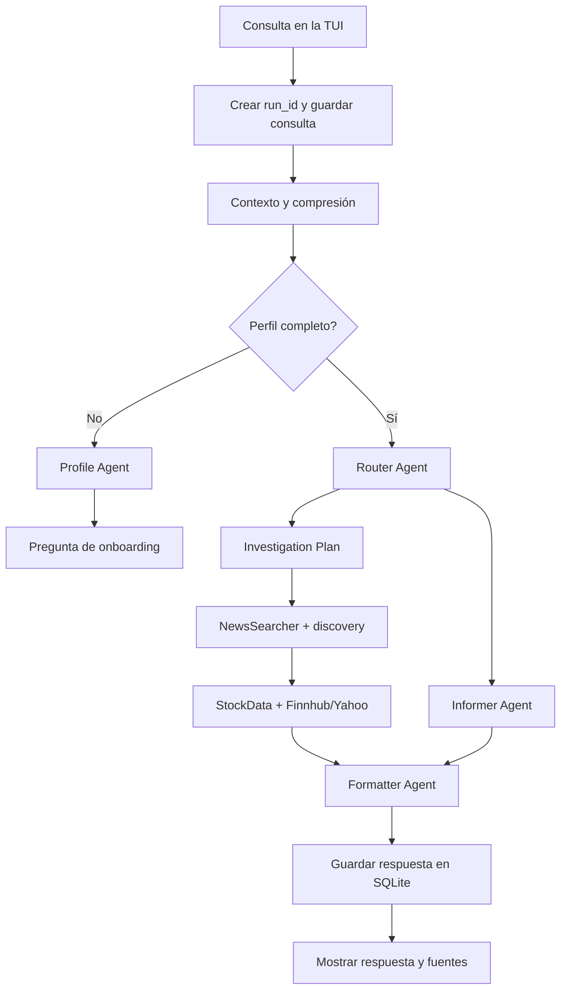

# Stock Local Agent

> Un asistente de investigación financiera educativo, local-first y orientado a terminal, construido con Rust, Tokio, Ratatui y Ollama.

[](https://www.rust-lang.org/)
[](https://doc.rust-lang.org/cargo/commands/cargo-test.html)
[](LICENSE)

## ¿Qué es?

**Stock Local Agent** es una aplicación de terminal para explorar preguntas sobre mercados financieros mediante una arquitectura multi-agente. Combina un modelo de lenguaje con búsquedas web, proveedores de datos de mercado y una base SQLite local para producir informes explicables con fuentes, precios y riesgos separados.

Está dirigido a:

- Personas que quieren aprender conceptos de inversión con una interfaz de terminal.
- Desarrolladores interesados en agentes asíncronos en Rust.
- Usuarios avanzados que quieren experimentar con Ollama, proveedores de mercado y flujos multi-agente.
- Contribuidores que quieran extender agentes, proveedores, almacenamiento o la TUI.

**No es un broker, no ejecuta operaciones y no ofrece asesoramiento financiero personalizado.** Los informes son educativos; verifica siempre los datos y toma decisiones de forma independiente.

## Características

- **Orquestación multi-agente**:
  - `Profile`: onboarding y perfil de experiencia.
  - `Router`: clasifica preguntas educativas, de investigación o fuera de dominio.
  - `Guardrails`: bloquean consultas ajenas al dominio antes de ejecutar agentes y evitan respuestas improvisadas sobre temas como recetas o cocina.
  - `Informer`: respuestas educativas.
  - `NewsSearcher`: búsqueda de noticias, sentimiento, catalizadores, riesgos y fuentes.
  - `StockData`: precios históricos verificables.
  - `Formatter`: informes Markdown con tablas y aviso financiero.
- **Investigación de mercado con provenance**:
  - Finnhub cuando `MARKET_API` está configurada.
  - Yahoo Finance como fallback automático si Finnhub rechaza un mercado o endpoint.
  - Resolución web de nombres y tickers si ambos proveedores fallan.
  - Timestamp, moneda, exchange y URL de origen en los precios.
  - El LLM nunca inventa los precios.
- **TUI de chat**:
  - Progreso por etapa y trazas en vivo.
  - Tokens de entrada, salida y total por ejecución.
  - Errores con `r` para reintentar y `d` para descartar.
  - Entrada de una línea con cursor, edición Unicode y scroll horizontal.
  - Selección/copia nativa del terminal porque la aplicación no captura el mouse.
  - Conversaciones persistentes en SQLite.
- **Guardrails de dominio**:
  - Solo se procesan temas de educación financiera, mercados, inversión y datos económicos.
  - Casos obvios como pizza, recetas, deportes o clima se bloquean determinísticamente.
  - El Router aplica una segunda clasificación `out_of_scope` para consultas no cubiertas por la lista rápida.
  - Las respuestas fuera de dominio son fijas y no llaman a Informer ni Formatter.
- **Resiliencia**:
  - `run_id` por ejecución.
  - Cancelación con `CancellationToken`.
  - Timeout total de cinco minutos.
  - Reintentos acotados para red, timeouts, HTTP 429 y HTTP 5xx.
  - Resultados parciales para que un ticker fallido no destruya todo el informe.
  - Caché TTL de datos de mercado.
- **Pruebas deterministas**:
  - Mocks de proveedores de mercado.
  - Mock HTTP local para respuestas de Ollama.
  - Pruebas de fallback, caché, parsing JSON, tokens y persistencia.

## Cómo funciona



Cada ejecución emite eventos tipados de inicio, etapa, trazabilidad, tokens, finalización o error. La UI filtra los eventos por `run_id`, por lo que una ejecución cancelada o antigua no puede modificar accidentalmente el chat activo.

## Requisitos

- Rust estable compatible con la edición 2024 (`rust-version = 1.85`).
- Terminal compatible con Unicode y colores.
- Ollama local o una cuenta de Ollama Cloud.
- `OLLAMA_API_KEY` para modelos Cloud y búsqueda web.
- Opcional: una API key de Finnhub para activar el proveedor primario.

## Instalación rápida

```bash
git clone https://github.com/AlvaroG13191704/stock-agent
cd stock-local-agent
cp .env.example .env
cargo run --release
```

Antes de iniciar, edita `.env`:

```dotenv
# Ollama Cloud
OLLAMA_BASE_URL=https://ollama.com
OLLAMA_API_KEY=tu_clave_de_ollama
DEFAULT_MODEL=gemma4:31b-cloud

# SQLite local
DATABASE_URL=sqlite:stock_agent.db

# Opcional: Finnhub como proveedor primario
MARKET_API=tu_clave_de_finnhub
FINNHUB_BASE_URL=https://finnhub.io/api/v1

# Fallback de mercado
MARKET_DATA_BASE_URL=https://query1.finance.yahoo.com
MARKET_DATA_CACHE_TTL_SECS=300
```

### Usar Ollama localmente

Para usar un modelo local en lugar de Ollama Cloud:

```dotenv
OLLAMA_BASE_URL=http://localhost:11434
DEFAULT_MODEL=gemma3:12b
OLLAMA_API_KEY=
```

La búsqueda web necesita `OLLAMA_API_KEY`. Si no se configura, las preguntas educativas locales pueden funcionar, pero los flujos de noticias y resolución web no estarán disponibles.

### Proveedores de mercado

- Con `MARKET_API`: `FinnhubProvider` se intenta primero y `YahooFinanceProvider` actúa como fallback.
- Sin `MARKET_API`: se usa Yahoo directamente.
- Los límites y permisos dependen del plan del proveedor.
- Un `403` de Finnhub no se soluciona reintentando; normalmente indica falta de acceso al mercado o endpoint.
- Para símbolos internacionales, usa sufijos cuando corresponda: `.T`, `.L`, `.HK`, `.TO`.

No incluyas nunca claves reales en Git. `.env` y la base SQLite local están excluidos por `.gitignore`.

## Uso de la TUI

| Tecla | Acción |
| --- | --- |
| `Enter` | Enviar consulta |
| `←` / `→` | Mover cursor |
| `Home` / `End` | Ir al inicio/final de la entrada |
| `Backspace` / `Delete` | Borrar sin romper Unicode |
| `Ctrl+U` | Limpiar entrada |
| `Tab` | Cambiar de conversación |
| `F2` | Crear conversación |
| `F4` | Borrar conversación |
| `F6` | Reiniciar perfil |
| `↑` / `↓` | Desplazar chat |
| `PgUp` / `PgDn` | Desplazamiento rápido |
| `r` / `d` tras un error | Reintentar / descartar |
| `Esc` / `Ctrl+C` | Salir |
| Mouse | Selección/copia nativa del emulador de terminal |

En macOS, selecciona texto arrastrando y copia con `Cmd+C`. Algunos emuladores requieren mantener `Option` o `Shift` durante la selección.

## Desarrollo y pruebas

Formato, compilación, tests y lint estricto:

```bash
cargo fmt -- --check
cargo check --locked
cargo test --locked
cargo clippy --all-targets --all-features --locked -- -D warnings
git diff --check
```

Para ejecutar las pruebas con salida detallada:

```bash
cargo test --locked -- --nocapture
```

Las pruebas no requieren API keys ni acceso a Internet. Usan mocks deterministas para:

- Proveedores de mercado exitosos y fallidos.
- Fallback Finnhub → Yahoo.
- Caché TTL.
- Respuestas JSON de Ollama y contadores de tokens.
- Parsing de respuestas Markdown o JSON incompleto.
- Persistencia de mensajes y runs.

La guía de pruebas está en [`docs/testing.md`](docs/testing.md).

## Estructura del proyecto

```text
src/
├── agents/
│   ├── formatter.rs       # Informe final
│   ├── informer.rs        # Flujo educativo
│   ├── investigation.rs   # Noticias, resolución y precios
│   ├── profile.rs         # Perfil del usuario
│   ├── router.rs          # Intención y plan
│   └── mod.rs             # Trait Agent y BaseAgent
├── events.rs              # Eventos por run y token usage
├── market_data.rs         # Finnhub, Yahoo, fallback y caché
├── models.rs              # Modelos de dominio y contratos tipados
├── ollama.rs              # Cliente HTTP de Ollama y web search
├── orchestrator.rs        # Coordinación, timeout y cancelación
├── storage.rs             # SQLite y migraciones
├── test_support.rs        # Mocks reutilizables de tests
└── ui.rs                  # TUI Ratatui/Crossterm
migrations/                # Esquema SQLite versionado
docs/                     # Arquitectura, Rust, pruebas y publicación
```

## Documentación

- [`docs/arquitectura.md`](docs/arquitectura.md): flujo multi-agente, eventos y proveedores.
- [`docs/rust_explanation.md`](docs/rust_explanation.md): Tokio, traits, composición y TUI.
- [`docs/testing.md`](docs/testing.md): estrategia de mocks y casos cubiertos.
- [`CONTRIBUTING.md`](CONTRIBUTING.md): cómo contribuir.
- [`SECURITY.md`](SECURITY.md): reporte de vulnerabilidades y manejo de secretos.
- [`CHANGELOG.md`](CHANGELOG.md): evolución del proyecto.

## Estado del proyecto

El proyecto está en fase experimental/public preview. El objetivo de Milestone 5 es dejar una base pública, reproducible y extensible para colaboración. Antes de considerarlo listo para producción todavía hay que validar distintos terminales, proveedores, modelos y límites de API.

### Próximos pasos

- Tests de integración end-to-end con servidores HTTP mock más completos.
- CI pública para Linux, macOS y Windows.
- Métricas opcionales y logging estructurado.
- Mejor resolución de exchange y normalización de símbolos.
- Soporte de streaming de respuestas del modelo.
- Configuración por archivo además de variables de entorno.
- Más proveedores con términos de uso compatibles.

## Licencia

Este proyecto se distribuye bajo la licencia MIT. Consulta [`LICENSE`](LICENSE).

## Aviso financiero

Este software y sus resultados son únicamente educativos e informativos. No constituyen asesoramiento financiero, fiscal o legal, ni una recomendación de comprar, vender o mantener activos. Los datos pueden contener retrasos, errores o estar sujetos a límites del proveedor.
