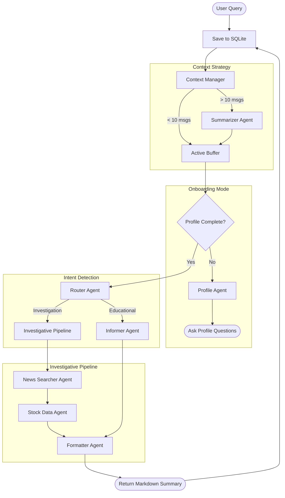

# Stock Agent Architecture & Orchestration Flow

This document describes how the Stock Agent processes user queries, handles profiling, and performs investigative research using a multi-agent orchestration pattern.

## System Overview

The system uses a **Pipe-and-Filter Agentic Architecture** where each agent is a specialized unit responsible for a specific part of the investment analysis.

## Agent Orchestration Flow

## Component Details

### 1. Context Manager
To handle the 250k token limit efficiently, the orchestrator automatically "compresses" conversations longer than 10 messages. It takes the first $N-2$ messages, generates a semantic summary, and prepends it to the last 2 interactions to maintain immediate logic flow without saturating the model.

### 2. Profile Agent
Before any investment advice is given, the system ensures it knows:
- **Investment Experience**
- **Knowledge Level**
- **Preferred Platforms**
- **Current Holdings**

### 3. Router Agent
Classifies user intent into:
- **Educational**: General questions about market mechanics, ETFs, or terms.
- **Investigation**: Deep dives into specific companies, news analysis, and price performance.

### 4. Investigative Pipeline
This is a three-stage process:
1. **News Searcher**: Uses dedicated search queries on Bloomberg and Google Finance to analyze current market sentiment.
2. **Stock Data**: Fetches "Today", "1 Week", and "1 Year" prices to calculate performance trends.
3. **Formatter**: Synthesizes all data into a "Premium Markdown" report.

## Cloud Model Configuration
The system uses the **Gemma 4** cloud model for high-reasoning tasks.
- **Model ID**: `gemma4`
- **Context Window**: 250k tokens (optimized via rolling summarization).
