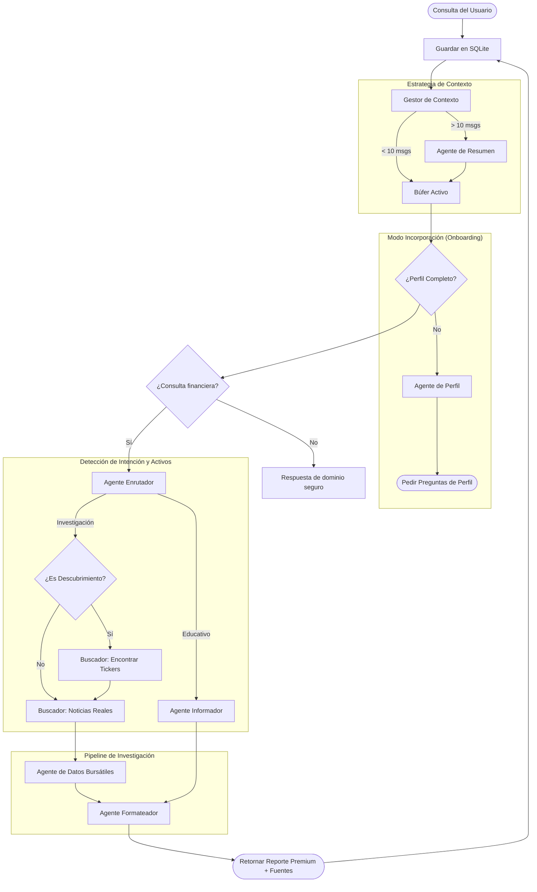

# Arquitectura del Agente de Bolsa y Flujo de Orquestación

Este documento describe cómo el Agente de Bolsa procesa las consultas de los usuarios, gestiona el perfilado y realiza investigaciones detalladas utilizando un patrón de orquestación multi-agente.

## Descripción General del Sistema

El sistema utiliza una **Arquitectura Agéntica de Tubería y Filtro (Pipe-and-Filter)** donde cada agente es una unidad especializada responsable de una parte específica del análisis de inversión.

## Flujo de Orquestación de Agentes

## Ciclo de vida y tolerancia a fallos

Cada consulta recibe un `run_id` y se persiste en la tabla `runs`. El orquestador emite eventos de inicio, trazabilidad, finalización o error mediante un canal asíncrono hacia la TUI. Las ejecuciones tienen un límite total de cinco minutos y pueden cancelarse al salir, cambiar de conversación o borrar un chat. Si la aplicación se cierra inesperadamente, los runs que quedaron en estado `running` se marcan como fallidos al iniciar.

La capa HTTP también aplica timeouts de conexión y de respuesta, con reintentos acotados para fallos de red, HTTP 429 y respuestas 5xx. Los errores de agentes o de persistencia ya no se descartan: se registran y se muestran al usuario. La TUI distingue fallos reintentables de errores definitivos y permite reintentar la última consulta como un nuevo run.

## Detalles de los Componentes

### 1. Gestor de Contexto
Para manejar el límite de 250k tokens de manera eficiente, el orquestador "comprime" automáticamente las conversaciones con más de 10 mensajes. Toma los primeros $N-2$ mensajes, genera un resumen semántico y lo antepone a las últimas 2 interacciones para mantener el flujo lógico inmediato sin saturar el modelo.

### 2. Agente de Perfil
Antes de que se brinde cualquier consejo de inversión, el sistema se asegura de conocer la experiencia, nivel de conocimiento, plataformas y tenencias actuales (holdings) del usuario.

### 3. Guardrails y Agente Enrutador
Antes de ejecutar agentes, una guardrail determinista bloquea casos obvios fuera del dominio, como recetas, cocina, deportes o clima. Para el resto, el `RouterAgent` clasifica la intención y puede devolver `out_of_scope`. Las consultas fuera de dominio reciben una respuesta fija y no se envían a `Informer` ni `Formatter`.

El Router clasifica la intención del usuario y extrae información sobre los objetivos:
- **Educativo**: Preguntas generales sobre mecánicas del mercado.
- **Investigación**: Análisis profundos de empresas o búsquedas temáticas.
  - Extrae **Tickers** directamente de la consulta.
  - Detecta **Modo Descubrimiento** si el usuario pide ideas nuevas (ej. "Busca acciones de IA").

### 4. Pipeline de Investigación
- **Buscador de Noticias (Modo Dual)**: 
  - **Fase de Descubrimiento**: Identifica tickers relevantes basados en temas.
  - **Fase de Análisis**: Obtiene noticias y sentimiento, preservando las URLs de las fuentes.
- **Datos Bursátiles**: `FinnhubProvider` obtiene precios de "Hoy", "1 semana" y "1 año" cuando `MARKET_API` está configurada. Incluye timestamp, moneda, exchange y URL de origen. Si Finnhub no tiene acceso a un endpoint o mercado, `YahooFinanceProvider` se usa automáticamente como fallback. Si ambos proveedores fallan, `StockData` consulta evidencia web para resolver el nombre y los sufijos del ticker antes de volver a consultar el mercado. El LLM no genera estos precios.
- **Formateador**: Sintetiza todo en un reporte con tablas visuales premium, separando datos verificables, interpretación, riesgos y citación de fuentes.
- **Concurrencia y resultados parciales**: Las búsquedas de noticias y precios se ejecutan con un límite de tres tareas simultáneas. Un fallo aislado se convierte en una advertencia/riesgo y no descarta los activos que sí pudieron verificarse.

## Observabilidad y consumo
El orquestador emite eventos tipados de etapa (`Stage`), trazas y uso de tokens (`Usage`). La interfaz acumula tokens de entrada, salida y total por run. Las respuestas de Ollama se leen desde `prompt_eval_count` y `eval_count`; si el servidor no proporciona esos campos, el contador permanece en cero. Los precios se almacenan en una caché TTL local (`MARKET_DATA_CACHE_TTL_SECS`, 300 segundos por defecto) para reducir llamadas repetidas.

## Configuración de proveedores
El proveedor de mercado predeterminado es `FinnhubProvider` cuando existe `MARKET_API`, con `YahooFinanceProvider` como fallback automático. Se puede cambiar el endpoint mediante `FINNHUB_BASE_URL`. Sin clave, la aplicación usa directamente Yahoo mediante `MARKET_DATA_BASE_URL`. Cuando ambos proveedores rechazan o no encuentran un símbolo, el agente utiliza el buscador web existente para resolver candidatos de ticker y sufijos de exchange. La abstracción `MarketDataProvider` permite sustituir ambos por un proveedor con licencia, API key o límites empresariales antes de un despliegue comercial. Revisa los términos de uso y límites del proveedor elegido.

## Configuración del Modelo en la Nube
El sistema utiliza el modelo en la nube **Gemma 4** para tareas de alto razonamiento.
- **ID del Modelo**: `gemma4`
- **Ventana de Contexto**: 250k tokens (optimizado mediante resumen dinámico).
