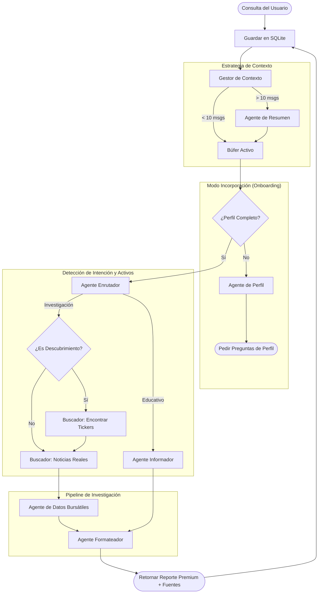

# Arquitectura del Agente de Bolsa y Flujo de Orquestación

Este documento describe cómo el Agente de Bolsa procesa las consultas de los usuarios, gestiona el perfilado y realiza investigaciones detalladas utilizando un patrón de orquestación multi-agente.

## Descripción General del Sistema

El sistema utiliza una **Arquitectura Agéntica de Tubería y Filtro (Pipe-and-Filter)** donde cada agente es una unidad especializada responsable de una parte específica del análisis de inversión.

## Flujo de Orquestación de Agentes

## Detalles de los Componentes

### 1. Gestor de Contexto
Para manejar el límite de 250k tokens de manera eficiente, el orquestador "comprime" automáticamente las conversaciones con más de 10 mensajes. Toma los primeros $N-2$ mensajes, genera un resumen semántico y lo antepone a las últimas 2 interacciones para mantener el flujo lógico inmediato sin saturar el modelo.

### 2. Agente de Perfil
Antes de que se brinde cualquier consejo de inversión, el sistema se asegura de conocer la experiencia, nivel de conocimiento, plataformas y tenencias actuales (holdings) del usuario.

### 3. Agente Enrutador
Clasifica la intención del usuario y extrae información sobre los objetivos:
- **Educativo**: Preguntas generales sobre mecánicas del mercado.
- **Investigación**: Análisis profundos de empresas o búsquedas temáticas.
  - Extrae **Tickers** directamente de la consulta.
  - Detecta **Modo Descubrimiento** si el usuario pide ideas nuevas (ej. "Busca acciones de IA").

### 4. Pipeline de Investigación
- **Buscador de Noticias (Modo Dual)**: 
  - **Fase de Descubrimiento**: Identifica tickers relevantes basados en temas.
  - **Fase de Análisis**: Obtiene noticias y sentimiento, preservando las URLs de las fuentes.
- **Datos Bursátiles**: Obtiene precios de "Hoy", "1 semana" y "1 año" para cálculos precisos.
- **Formateador**: Sintetiza todo en un reporte con tablas visuales premium y citación de fuentes.

## Configuración del Modelo en la Nube
El sistema utiliza el modelo en la nube **Gemma 4** para tareas de alto razonamiento.
- **ID del Modelo**: `gemma4`
- **Ventana de Contexto**: 250k tokens (optimizado mediante resumen dinámico).
